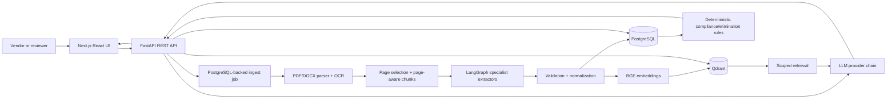
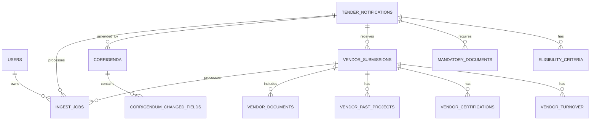
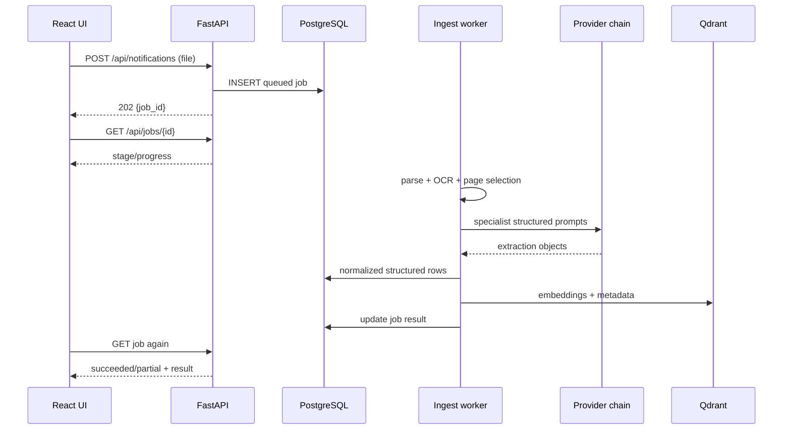
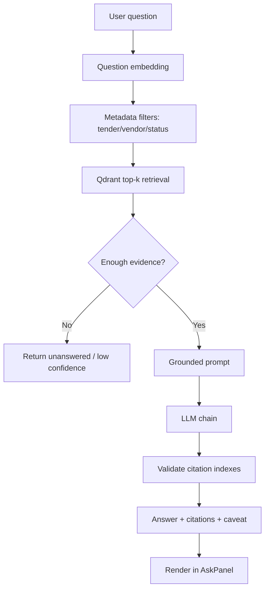

# TenderIQ / BidSense — Interview Preparation Guide

## How to use this document

This guide is written from the **TenderIQ scope and planned architecture**, not only from the currently implemented screens. That distinction matters in an interview.

Use language like:

> “The planned system has two sides: a vendor compliance tool and a company-side evaluation tool. The current codebase completes the shared extraction pipeline and most of the vendor-side workflow; the company-side bulk elimination, shortlist and cross-vendor agent are the next planned modules.”

The project is not a traditional MERN implementation. Its actual planned/current stack is:

| Layer | Project choice | Interview explanation |
|---|---|---|
| Frontend | Next.js 14, React, TypeScript, Tailwind | React architecture with Next.js App Router |
| Backend | FastAPI, Python | REST API and orchestration layer; conceptually equivalent to an Express backend |
| Structured database | PostgreSQL 16, SQLAlchemy, Alembic | Relational source of truth for extracted fields and audit data |
| Vector database | Qdrant | Semantic retrieval for free-text tender and bid sections |
| Document processing | pypdf, pdfplumber, python-docx, Tesseract | Text extraction, table handling and OCR |
| AI orchestration | LangGraph | Parallel, schema-guided extraction workflow |
| Embeddings | BGE, 768 dimensions | Converts text into vectors for semantic search |
| LLM providers | Gemini → Groq → Ollama chain | Availability fallback, not an accuracy ranking |

Therefore, when asked about MERN, be honest: **React, Node.js/Express concepts and MongoDB are interview topics, but this project itself uses FastAPI and PostgreSQL instead of Express and MongoDB.**

---

## 1. Project overview

### 1.1 One-minute explanation

TenderIQ is a document-intelligence platform for tender and RFP evaluation. A tender contains eligibility rules, mandatory documents, deadlines, financial thresholds and technical requirements. Vendors often fail because they miss a certificate, submit an incorrect amount, or misunderstand a clause. Companies face the opposite problem: they must read and compare many vendor submissions manually.

The system reads tender notifications and vendor submissions, extracts important facts into a common structured schema, stores factual fields in PostgreSQL, stores searchable narrative text in Qdrant, and exposes two experiences:

1. **Vendor tool:** compare one bid with one tender, generate a cited compliance/gap report, produce a practical action list, and answer questions using grounded retrieval.
2. **Company tool:** ingest many vendor bids, apply deterministic elimination rules, create a non-ranked qualified shortlist, and ask cross-vendor questions through a structured/vector/hybrid query router.

The key design principle is: **use NLP/LLMs to read and retrieve language; use deterministic code and SQL to make auditable comparisons.**

### 1.2 Problem statement

Manual tender review is slow, inconsistent and difficult to audit. A reviewer may miss a mandatory document or apply a threshold differently from another reviewer. A vendor may only discover a missing requirement after submission.

TenderIQ addresses this by turning unstructured documents into:

- structured fields such as deadline, turnover, certifications and EMD;
- provenance such as clause, page and source snippet;
- deterministic compliance results;
- semantic search over qualitative content;
- explainable audit records.

### 1.3 Target users

- **Vendor/bidder:** checks whether a proposed bid is ready.
- **Company/authority reviewer:** evaluates many vendor bids.
- **Evaluation committee:** reviews a shortlist and an exportable report.
- **System administrator:** manages configuration, providers and access.

### 1.4 What makes the project technically interesting

The project is not merely “upload PDF and call an LLM.” The challenging parts are:

- messy PDFs, scans, tables and OCR;
- long-document page selection;
- schema-constrained information extraction;
- Indian currency normalization;
- document-name synonym matching;
- deterministic elimination over extracted fields;
- citation-grounded RAG;
- status-scoped retrieval and confidentiality;
- corrigendum/version changes;
- fallback between LLM providers;
- partial failure and data-quality reporting.

---

## 2. Planned feature and module list

### 2.1 Shared document platform

1. Upload PDF/DOCX files.
2. Validate file type and upload size.
3. Parse text and tables.
4. Detect scanned pages and use OCR where needed.
5. Split text into page-aware chunks.
6. Select relevant pages for each extraction field group.
7. Run specialist extraction nodes in parallel.
8. Validate structured output.
9. Normalize money and other values in code.
10. Persist structured information in PostgreSQL.
11. Embed narrative chunks and index them in Qdrant.
12. Track job progress and partial failures.
13. Keep source page, clause and snippet provenance.

### 2.2 Vendor-side modules

- Notification upload.
- Vendor submission upload against a tender.
- Extraction progress screen.
- Tender overview and requirements view.
- Compliance/gap report.
- Document matching using exact, alias and embedding tiers.
- Numeric threshold checks.
- Boolean checks such as blacklist or eligibility.
- Manual-check flags for visual rules.
- Conditional requirements.
- Missing-item action list.
- Grounded Q&A across tender and submission.
- Citation click-through to rendered source pages.
- Corrigendum upload and stale-report warning.
- PDF/DOCX export.
- Health/dependency status.

### 2.3 Company-side planned modules

- Bulk upload of submissions.
- Vendor status management: `eliminated`, `pending`, `shortlisted`.
- Level 1 deterministic elimination.
- Elimination reason with failed clause and extracted value.
- Level 2 qualified, non-ranked shortlist.
- Human committee remains final decision-maker.
- Level 3 cross-vendor query agent.
- Structured lookup, comparison, qualitative RAG and audit queries.
- Unified audit trail.
- Blacklist/debarment flag.
- Corrigendum propagation to prior evaluations.
- Committee report export.

### 2.4 Current implementation boundary

Implemented foundation/current slice:

- `backend/app/ingest/`: PDF/DOCX parsing, OCR and chunking.
- `backend/app/extraction/`: page selection, prompts, LangGraph extraction, conversion, validation and persistence.
- `backend/app/normalize/money.py`: canonical Indian rupee normalization.
- `backend/app/db/models/`: SQLAlchemy schema for notifications, submissions, jobs, corrigenda, users and cache.
- `backend/app/vector/`: Qdrant schema, embeddings and indexing.
- `backend/app/compliance/`: gap report, matching and export.
- `backend/app/rag/`: retrieval and citation-checked answers.
- `backend/app/api/`: FastAPI routes and job polling.
- `frontend/components/`: upload, progress, requirements, gap report, action list, Q&A and citations.

Planned/extension boundary:

- full company-side bulk evaluation UI;
- production authentication and route guards;
- complete Level 1/2/3 company workflow;
- query-intent router over multiple vendors;
- final committee workflow and production deployment hardening.

---

## 3. Overall architecture



### 3.1 Why two stores?

PostgreSQL is best for exact facts, constraints, joins, filtering and transactions. Qdrant is best for semantic similarity over paragraphs such as methodology, technical approach and past-project descriptions.

Example:

- “Turnover must be at least ₹5 Cr” is a PostgreSQL field and rule comparison.
- “Which vendor describes an approach that handles high availability?” is a semantic retrieval problem and belongs in Qdrant.

PostgreSQL remains authoritative. Qdrant is a derived search index. If a vendor status changes, the status metadata in Qdrant must be retagged so retrieval does not return stale or unauthorized results.

### 3.2 Architecture decisions

| Decision | Reason |
|---|---|
| FastAPI rather than a synchronous upload endpoint | Extraction can take minutes; jobs return `202 Accepted` and are polled |
| PostgreSQL for hard fields | Thresholds, joins, constraints and auditability need relational semantics |
| Qdrant for narratives | Vector similarity is more useful than exact SQL matching for qualitative text |
| Page-aware chunks | A citation must identify a real page; chunks must not silently span pages |
| Specialist extraction nodes | A failure in one field group should not lose the complete document |
| Code normalizes money | Arithmetic and unit conversion must be deterministic and auditable |
| No LLM elimination judgment | Disqualification requires predictable, explainable rules |
| Cache by content hash and pipeline version | Re-uploading the same file must not waste LLM quota or serve stale extraction |
| Exact → alias → embedding document matching | Exact matching misses synonyms; embeddings alone can confuse similar names |
| `NULL` for unparseable amounts | Unknown is not zero; coercing to zero could wrongly eliminate a vendor |
| No invented score preview | A score is shown only when the tender actually publishes weights |

---

## 4. Folder and codebase map

```text
TENDER_SYSTEM/
├── backend/
│   ├── app/
│   │   ├── api/              FastAPI routes, schemas, jobs, health
│   │   ├── bidgen/           Planned/generated bid content utilities
│   │   ├── compliance/       Gap report, matching, export, PDF generation
│   │   ├── corrigendum/      Amendment diff and staleness logic
│   │   ├── db/
│   │   │   ├── models/       SQLAlchemy ORM tables
│   │   │   ├── repository.py Read/write mapping functions
│   │   │   └── session.py    Engine and DB sessions
│   │   ├── documents/        Retained source documents and page rendering
│   │   ├── extraction/       LangGraph, prompts, schemas, validation, persistence
│   │   ├── ingest/           PDF/DOCX loading, OCR, chunking
│   │   ├── llm/              Provider implementations, chain and rate limiting
│   │   ├── normalize/        Money and semantic normalization helpers
│   │   ├── rag/              Retrieval and grounded answering
│   │   ├── schemas/          Shared Pydantic extraction schema
│   │   └── vector/           Embedding model and Qdrant operations
│   ├── migrations/           Alembic migrations
│   ├── scripts/              Bootstrap, ingest, evaluation and data generation
│   └── tests/                Unit, integration, API, RAG and regression tests
├── frontend/
│   ├── app/                  Next.js App Router pages
│   ├── components/           Reusable React UI components
│   └── lib/                  API client and TypeScript types
├── data/                     Example/benchmark tender data
├── docker-compose.yml        PostgreSQL and Qdrant services
└── TenderIQ_Scope_v2.md      Planned product specification
```

Important files to mention:

- API: `backend/app/api/routes.py`, `backend/app/api/jobs.py`, `backend/app/api/schemas.py`.
- Extraction: `backend/app/extraction/graph.py`, `pipeline.py`, `selection.py`, `prompts.py`, `validate.py`, `persist.py`.
- Ingestion: `backend/app/ingest/loader.py`, `pdf.py`, `docx.py`, `ocr.py`, `chunking.py`.
- Data model: `backend/app/db/models/notification.py`, `submission.py`, `job.py`, `corrigendum.py`, `user.py`.
- Compliance: `backend/app/compliance/gap.py`, `matching.py`, `requirements.py`, `export.py`.
- RAG: `backend/app/rag/retrieve.py`, `answer.py`.
- Vector: `backend/app/vector/embeddings.py`, `qdrant.py`, `schema.py`.
- Frontend API: `frontend/lib/api.ts`; frontend types: `frontend/lib/types.ts`.
- Main UI modules: `GapReport.tsx`, `AskPanel.tsx`, `ActionList.tsx`, `JobProgress.tsx`, `CitationViewer.tsx`.

---

## 5. Shared extraction schema and database design

### 5.1 Notification data

The notification stores:

- tender id, title, authority and sector;
- submission deadline and pre-bid deadline;
- EMD and estimated contract value;
- eligibility criteria;
- mandatory documents;
- evaluation criteria and optional weightage;
- technical requirements;
- format rules;
- source/provenance metadata.

### 5.2 Vendor submission data

The submission stores:

- vendor id and vendor name;
- turnover by year;
- years in business;
- certifications and expiry dates;
- past projects, value, year and description;
- documents submitted and whether they are present;
- technical approach and pricing summary;
- blacklist flag;
- status and elimination reason;
- provenance for extracted values.

### 5.3 Corrigendum data

A corrigendum stores its parent tender, issue date, source file and changed fields. Each changed field includes a dotted path such as `submission_deadline`, old value, new value and clause provenance.

### 5.4 Relationship diagram



### 5.5 Keys and constraints

- Every table has a UUID primary key.
- Foreign keys connect child rows to the tender or vendor submission.
- Cascading delete removes child extraction rows when the parent is replaced.
- Turnover is unique per submission and year.
- Email is unique for users.
- Required fields are `NOT NULL`.
- PostgreSQL enums represent statuses and roles.
- A database check requires an elimination reason when status is `eliminated`.
- Monetary columns use numeric/decimal types rather than floating-point values.

### 5.6 Why hybrid normalized + JSONB storage?

Frequently queried fields are normalized into tables because SQL needs to filter and compare them. Display-only or evolving extraction payloads may be retained as JSONB. This gives structured rule evaluation without losing flexibility when the schema evolves.

---

## 6. End-to-end workflow: notification upload

1. User selects a PDF/DOCX in `FileDrop` or the upload page.
2. React creates `FormData` and calls `POST /api/notifications`.
3. FastAPI validates suffix and enforces a 50 MB limit.
4. The file is saved to a temporary path.
5. The API creates an `ingest_jobs` row and submits background work.
6. The API immediately returns `202` with `job_id` and `poll_url`.
7. The frontend calls `GET /api/jobs/{job_id}` repeatedly with backoff.
8. The loader extracts text from PDF/DOCX.
9. Empty/scanned pages are sent to Tesseract if available.
10. Text is divided into chunks that never cross page boundaries.
11. Page selection chooses likely pages for each field group.
12. LangGraph runs specialist extraction nodes for header, eligibility, documents, evaluation and technical data.
13. LLM output is converted into project Pydantic schemas.
14. Money is normalized by deterministic code.
15. Validation records warnings and missing/unparseable values.
16. PostgreSQL receives notification rows and provenance.
17. Narrative chunks are embedded and upserted to Qdrant.
18. Job status becomes `succeeded`, `partial` or `failed`.
19. The UI displays the result or a meaningful error.



### 6.1 Why asynchronous jobs?

Extraction can take minutes because there may be six LLM calls, provider rate limits and OCR. Keeping an HTTP request open would cause browser/proxy timeouts. A durable job row lets the UI show progress and lets a restart leave an explicit failed job rather than silently losing work.

---

## 7. End-to-end workflow: vendor compliance report

1. Vendor uploads the tender notification.
2. Vendor uploads a bid with `vendor_id` and `tender_id`.
3. Backend checks that the tender exists before queueing the bid.
4. The bid goes through the same parse/OCR/extraction pipeline.
5. `POST /api/gap-report` receives tender and vendor identifiers.
6. Backend loads notification requirements and vendor fields from PostgreSQL.
7. Document requirements are matched using exact name, alias table, then embedding similarity.
8. Numeric criteria compare canonical rupee values.
9. Boolean criteria check fields such as blacklist or presence.
10. Format rules become `manual_check`, because text extraction cannot prove visual signing/stamping.
11. Each result becomes `match`, `partial`, `missing`, `manual_check` or `not_assessable`.
12. The report includes severity, explanation, raw/found values and provenance.
13. The action-list builder groups findings into hard failures, uploads, clarifications and manual verification.
14. If scoring weights are absent from the tender, the score preview is unavailable rather than fabricated.
15. The UI renders the completion meter, gap report and action list.

### 7.1 Important business rules

- A missing mandatory document is a high-priority failure.
- A value below a published threshold is a hard failure.
- An unparseable amount is unknown, not zero.
- A document with a different but recognized name can still match.
- A visual format requirement needs manual checking.
- A conditional requirement applies only when its condition is true.
- “No extracted requirements” is `not_checked`, not `compliant`.
- A stale report must show a corrigendum warning.

---

## 8. End-to-end workflow: RAG Q&A

Example: “What is the EMD amount and when is the submission deadline?”

1. User enters a question in `AskPanel`.
2. Frontend sends `POST /api/ask` with question, tender id and optional vendor id.
3. Backend creates an embedding for the question.
4. Qdrant is searched with metadata filters for the tender and, when needed, the vendor.
5. Top passages are returned with page, clause, source file and score.
6. If retrieval confidence is too low, the model is not called; the system returns an unanswered state.
7. Otherwise the passages are included in a grounded prompt.
8. The LLM answers only from the supplied passages.
9. Citation indexes in the answer are checked against retrieved citations.
10. Invented citation indexes are stripped or the answer is marked not grounded.
11. Frontend displays the answer, confidence, citations and caveat.
12. Clicking a citation requests the rendered source page and highlights the snippet.



### 8.1 Why pre-filter retrieval?

Retrieval is filtered before ranking. Post-filtering after retrieving a broad set can leak another tender or vendor into the top results and produce a plausible but wrong answer. Tenant/status scope is part of correctness, not merely security.

---

## 9. Planned company-side workflow

### 9.1 Bulk ingestion

The company user uploads one notification and many vendor submissions. Each submission is linked to a tender and vendor identity. Extraction is parallelized or queued, with independent job status and partial-result handling.

### 9.2 Level 1 elimination

Rules evaluate:

- turnover threshold;
- minimum years of experience;
- mandatory document presence;
- certification validity;
- blacklist/debarment flag;
- mandatory form completion;
- other hard conditions.

Example rule:

```text
IF latest_eligible_turnover < required_turnover
THEN status = eliminated
     reason = "Turnover ₹2.1 Cr < required ₹5 Cr, clause 4.2"
```

The result is either `eliminated` or `pending`; `pending` means it passed hard elimination and awaits shortlist review. It is intentionally not called “passed” because that could imply final approval.

### 9.3 Level 2 shortlist

The reviewer chooses a target count and factors such as experience, project scale, technical approach and price. The system produces a qualified pool with grounded summaries, not a legally authoritative numeric ranking. Human committee members make the final selection.

### 9.4 Level 3 query router

The router classifies a question:

| Query | Route |
|---|---|
| “Which vendors have turnover above ₹5 Cr?” | PostgreSQL structured query |
| “Compare three shortlisted vendors on project value.” | SQL aggregation + response formatter |
| “Which approach discusses scalability?” | Qdrant semantic RAG |
| “Why was Vendor X eliminated?” | PostgreSQL reason + cited clause |
| “Which vendors meet the threshold and explain their approach?” | Hybrid SQL filter + vector retrieval |

This router is a lightweight intent-classification layer. It should not allow an LLM to invent database results; tools return the evidence, and the model summarizes it.

---

## 10. Frontend preparation

### 10.1 React architecture

The frontend uses Next.js App Router pages and reusable client components. Pages represent routes such as:

- `/` dashboard/workspace;
- `/upload` upload flow;
- `/tenders/[tenderId]` tender workspace;
- `/tenders/[tenderId]/bids/[vendorId]` vendor-specific bid view.

Reusable components include `FileDrop`, `JobProgress`, `GapReport`, `ActionList`, `AskPanel`, `RequirementsView`, `CitationViewer`, `TenderWorkspace` and shared UI elements.

### 10.2 Props and state

- Props pass data and callbacks from parent to child.
- State stores local UI values such as selected file, input question, loading state and open citation.
- Derived values such as counts or progress should be calculated from state rather than duplicated.
- The API client uses TypeScript interfaces so backend shape changes fail near the UI use site.

### 10.3 Hooks used conceptually

- `useState`: form input, loading and report state.
- `useEffect`: health checks, job polling or data loading.
- `useMemo`: expensive derived summaries when needed.
- `useCallback`: stable callbacks passed to child components when rerenders matter.
- `useRef`: abort controllers, DOM references or preserving values between renders.

### 10.4 API integration

`frontend/lib/api.ts` centralizes fetch calls. The `request<T>` helper:

- uses `NEXT_PUBLIC_API_URL` or a local default;
- disables stale caching for dynamic API results;
- converts network errors into a readable `ApiError`;
- reads FastAPI validation details;
- returns typed JSON.

File uploads use `FormData`. JSON operations use `Content-Type: application/json`.

### 10.5 Loading and errors

The UI should distinguish:

- upload rejected;
- backend unreachable;
- job queued/running;
- extraction partial;
- extraction failed;
- report stale due to corrigendum;
- data low-confidence or not assessable.

This is important because “the system could not read it” is not the same as “the vendor failed.”

### 10.6 Protected routes and auth plan

The schema already has users, roles and owner foreign keys. The planned browser flow is:

1. Login sends credentials to the backend.
2. Backend verifies password hash with bcrypt.
3. Backend returns a short-lived access token, usually JWT.
4. Frontend sends the token in `Authorization: Bearer <token>`.
5. Backend middleware decodes and verifies the token.
6. Role dependency allows vendor or company reviewer actions.
7. Ownership checks ensure a vendor sees only its own submission.

Do not rely only on hiding links in React. Authorization must be enforced on the server for every sensitive endpoint.

### 10.7 JavaScript concepts to know

- lexical scope and closures;
- `let`, `const`, destructuring and spread;
- array methods such as `map`, `filter`, `find`, `reduce`;
- immutability in state updates;
- promises and `async/await`;
- `try/catch/finally`;
- event handlers and event bubbling;
- debouncing for search/input;
- aborting fetch requests;
- TypeScript narrowing and union types;
- JSON serialization;
- module imports/exports.

---

## 11. Backend preparation

### 11.1 FastAPI architecture

The project separates responsibilities:

- **Routes:** HTTP methods, path parameters, request parsing and response models.
- **Dependencies:** database sessions and resource lookup such as `require_notification`.
- **Job runner:** asynchronous ingestion lifecycle.
- **Services/modules:** ingestion, extraction, normalization, compliance and RAG.
- **Models:** SQLAlchemy persistence.
- **Schemas:** Pydantic validation and API contracts.

In an Express version, these same concepts would map to routers, middleware, controllers, services and repositories.

### 11.2 Request lifecycle

1. Uvicorn receives the HTTP request.
2. FastAPI matches method and path.
3. Request body, query and form values are validated.
4. Dependencies create a DB session or load a parent object.
5. Route calls the application service.
6. Service reads/writes PostgreSQL, Qdrant or LLM provider.
7. Exceptions become HTTP errors.
8. Pydantic response model serializes the result.
9. JSON or binary file response returns to the frontend.

### 11.3 REST API examples

| Method | Endpoint | Purpose |
|---|---|---|
| GET | `/api/health` | Dependency health |
| POST | `/api/notifications` | Queue notification ingestion |
| POST | `/api/submissions` | Queue vendor bid ingestion |
| POST | `/api/corrigenda` | Queue amendment ingestion |
| GET | `/api/jobs/{job_id}` | Poll ingestion status |
| GET | `/api/notifications` | List tenders |
| GET | `/api/notifications/{tender_id}` | Tender detail |
| GET | `/api/notifications/{tender_id}/submissions` | Submission summaries |
| POST | `/api/gap-report` | Build compliance report |
| POST | `/api/ask` | Grounded Q&A |
| GET | `/api/documents/{hash}/page/{page}` | Citation page image |
| POST | `/api/gap-report/export` | PDF/DOCX report export |

### 11.4 Validation and error handling

- Validate file suffix and maximum size before queueing.
- Validate tender existence before accepting a submission.
- Use typed request/response schemas.
- Use explicit HTTP status codes: `202` for accepted jobs, `404` for missing resources, `415` for unsupported files, `413` for oversized files.
- Log detailed server-side context but return safe user-facing messages.
- Preserve partial output and warnings instead of pretending the job fully succeeded.

### 11.5 Security

- Hash passwords with bcrypt; never store plaintext.
- Use JWT signing secrets from environment variables.
- Validate ownership and role on server routes.
- Limit uploads and reject unsupported suffixes.
- Sanitize filenames and avoid path traversal.
- Parameterize SQL through SQLAlchemy.
- Restrict CORS to known frontend origins in production.
- Do not expose provider API keys to the frontend.
- Scope Qdrant filters by tender/vendor/status.
- Avoid logging full confidential bid text.
- Use HTTPS in deployment.

### 11.6 Configuration

Settings should come from environment variables, not source code. Examples include database URL, Qdrant URL, provider keys, LLM provider/chain, CORS origins, upload limits and page-render settings. `.env` is local configuration and must not be committed.

---

## 12. PostgreSQL interview preparation

### 12.1 Core concepts in simple language

PostgreSQL stores data in tables. A row is one record. A column is one attribute. A primary key uniquely identifies a row. A foreign key connects related rows. A transaction groups operations so they succeed or fail together.

### 12.2 Project-specific tables

- `users`
- `tender_notifications`
- `eligibility_criteria`
- `mandatory_documents`
- `vendor_submissions`
- `vendor_turnover`
- `vendor_certifications`
- `vendor_past_projects`
- `vendor_documents`
- `corrigenda`
- `corrigendum_changed_fields`
- `ingest_jobs`
- `extraction_cache`

### 12.3 Example SQL

Find vendors whose normalized latest turnover is at least ₹5 Cr:

```sql
SELECT DISTINCT s.vendor_id, s.vendor_name, t.amount_inr
FROM vendor_submissions s
JOIN vendor_turnover t ON t.submission_id = s.id
WHERE t.year = (
  SELECT MAX(t2.year)
  FROM vendor_turnover t2
  WHERE t2.submission_id = s.id
)
AND t.amount_inr >= 50000000
AND s.status <> 'eliminated';
```

Find missing mandatory documents:

```sql
SELECT s.vendor_id, m.doc_name
FROM vendor_submissions s
CROSS JOIN mandatory_documents m
LEFT JOIN vendor_documents d
  ON d.submission_id = s.id
 AND d.matched_requirement_id = m.id
WHERE s.tender_id = :tender_id
  AND COALESCE(d.present, false) = false;
```

### 12.4 JOINs

- `INNER JOIN`: only matching rows.
- `LEFT JOIN`: keep all rows from the left table, even if no child exists.
- `CROSS JOIN`: every combination; useful for comparing each vendor with every mandatory requirement, but use carefully because it can multiply rows.

### 12.5 Normalization

The data is normalized so repeated child data is not stored in one giant vendor row. Turnover, certificates, projects and documents are separate tables. This avoids update anomalies and allows each item to carry provenance. JSONB is kept only where flexible storage is useful.

### 12.6 Indexes

Useful indexes include:

- tender id and vendor id;
- foreign keys;
- job status;
- user email;
- normalized turnover amount;
- content hash and document kind for cache lookup.

Indexes speed reads but consume storage and make writes slightly more expensive. Add them to real lookup/filter columns, not every column.

### 12.7 Transactions and ACID

When re-ingesting a document, old structured rows and old vector chunks should be removed/replaced as one logical operation. A transaction prevents a half-replaced extraction from appearing authoritative. PostgreSQL provides atomicity, consistency, isolation and durability.

### 12.8 Connection pooling

Creating a new DB connection for every request is expensive. SQLAlchemy’s engine manages a pool, reuses connections and limits concurrent database pressure. Sessions should be short-lived and closed after each request/job.

### 12.9 Database security

- Use a dedicated application DB user with least privilege.
- Keep passwords in environment/secret management.
- Use TLS for remote DB connections.
- Restrict network access.
- Back up PostgreSQL.
- Use migrations rather than manual production edits.

---

## 13. MongoDB and MERN preparation

### 13.1 MongoDB fundamentals

MongoDB is a document database. It stores JSON-like BSON documents inside collections. A document can contain nested arrays and objects, making it convenient for rapidly changing or naturally hierarchical data.

Example vendor document:

```js
{
  vendorId: "V-42",
  vendorName: "Example Systems",
  turnover: [
    { year: 2024, amountInr: 50000000 }
  ],
  certifications: [
    { name: "GST", validTill: "2027-03-31", docPresent: true }
  ]
}
```

### 13.2 MongoDB CRUD

```js
db.vendors.insertOne(vendor)
db.vendors.find({ "turnover.amountInr": { $gte: 50000000 } })
db.vendors.updateOne({ vendorId: "V-42" }, { $set: { status: "pending" } })
db.vendors.deleteOne({ vendorId: "V-42" })
```

### 13.3 Mongoose

Mongoose adds schemas, validation, models, middleware and query helpers on top of MongoDB. It is not the database itself.

### 13.4 Relationships in MongoDB

You can embed child data when it is read and updated with the parent and does not grow without bound. You can reference another document when the child is large, shared or independently queried. A tender/vendor system may embed small certifications but reference large documents or job records.

### 13.5 MongoDB versus PostgreSQL

| Concern | MongoDB | PostgreSQL |
|---|---|---|
| Shape | Flexible documents | Structured relational tables |
| Joins | Possible but less central | Strong JOIN support |
| Constraints | Application/schema validation | Strong database constraints |
| Best fit here | Raw evolving extraction payloads | Eligibility rules, thresholds, audit trail |
| Transactions | Supported | Mature and central |
| Query style | Document/aggregation | SQL/relational |

For this project PostgreSQL is better because elimination depends on exact joins, thresholds, constraints and auditability. MongoDB would be reasonable for raw extraction payloads or rapidly evolving document metadata, but it should not replace the authoritative relational rule store without a clear reason.

### 13.6 MERN mapping

- MongoDB: document database.
- Express: Node HTTP framework.
- React: frontend library.
- Node.js: JavaScript runtime.

The project uses React/Next.js but FastAPI/PostgreSQL/Qdrant. Explain the transferable ideas—routes, controllers, middleware, async handling, REST and authentication—without claiming Express or MongoDB was used in production code.

---

## 14. Core technical concepts

### JavaScript

Know primitive vs reference values, closures, promises, async/await, event loop, destructuring, modules, immutability, error propagation and array methods. In the UI, these appear in typed fetch helpers, state updates, polling and rendering lists.

### React

React renders a UI from state and props. State changes trigger rerendering. Components should be small and reusable. Controlled forms keep input values in React state. Effects are for synchronization with external systems such as APIs, not for ordinary calculations.

### Node.js

Node runs JavaScript on V8 and uses an event-driven, non-blocking I/O model. It is good for many concurrent network requests, but CPU-heavy work can block the event loop unless moved to workers or another service. In a Node implementation, PDF/LLM jobs would need background workers just like the current FastAPI job design.

### Express

Express routes requests through middleware and route handlers. A typical structure is:

```text
request → CORS/logger/auth middleware → router → controller → service → repository → response
```

FastAPI has the same separation, using dependencies and typed schemas instead of Express middleware functions.

### HTTP and REST

- `GET`: read.
- `POST`: create/action.
- `PUT`: replace.
- `PATCH`: partial update.
- `DELETE`: remove.
- `200`: success.
- `201`: created.
- `202`: accepted for asynchronous work.
- `400/422`: invalid request.
- `401`: unauthenticated.
- `403`: authenticated but forbidden.
- `404`: missing resource.
- `409`: conflict.
- `500`: server failure.

### Async programming and event loop

`async/await` makes promise-based work readable. Awaiting I/O does not block the whole server, but CPU-heavy OCR or embedding work may still require workers/processes. Errors must be caught or propagated deliberately.

### Middleware

Middleware runs before/around a route. Common examples are CORS, logging, authentication, rate limiting, request IDs and error conversion.

### JWT

A JWT is a signed token containing claims such as user id, role and expiry. It is signed, not encrypted, so sensitive data should not be placed inside. The backend verifies the signature and expiry on every request.

### bcrypt

bcrypt is a slow password-hashing algorithm with a salt. Store the hash, then compare a login password against it. Never encrypt or log plaintext passwords.

### CORS

CORS is a browser security policy controlling which origins may call the API. It is not authentication. Configure explicit production origins and allow credentials only when necessary.

### Authentication versus authorization

- Authentication: “Who are you?”
- Authorization: “What may you do?”

Vendor isolation requires both identity verification and permission/ownership checks.

### Security model

Use defense in depth: validation, authentication, authorization, secure secrets, parameterized queries, upload controls, scoped retrieval, safe error messages, logging and HTTPS.

---

## 15. Engineering quality

### Performance

- Cache extraction by file content hash and pipeline version.
- Select only relevant pages for each LLM call.
- Run independent field-group extraction nodes in parallel.
- Use batched embeddings.
- Use database indexes and pagination.
- Poll jobs with backoff rather than aggressively.
- Render only a requested citation page.

### Scalability

Separate API workers from ingestion workers. Put jobs on a durable queue for production. Scale OCR/embedding/extraction workers independently. Use PostgreSQL read replicas for reporting if necessary. Keep Qdrant metadata filters precise. Store large source files in object storage rather than local disks.

### Logging and observability

Use structured logs with job id, tender id, vendor id, stage, provider and duration. Never log sensitive full bids. Track extraction quality, partial failures, provider fallback, retrieval scores, invented citation count and job duration.

### Testing strategy

- Unit tests for money parsing, matching, validation and business rules.
- API tests for upload, status codes and error paths.
- Integration tests for PostgreSQL/Qdrant interaction.
- RAG tests for retrieval scope and citation validation.
- Regression tests using representative tenders.
- Evaluation tests for field recall and page selection.
- Load tests for concurrent uploads.
- Security tests for cross-vendor access attempts.

### Deployment

Local development uses Docker Compose for PostgreSQL and Qdrant, a Python virtual environment for the backend and Next.js dev server for the frontend. Production should use:

- managed PostgreSQL;
- managed/secured Qdrant;
- object storage for files;
- worker process and durable queue;
- secret manager;
- CI/CD with migrations and tests;
- HTTPS and monitoring.

### Git

Use small feature branches and descriptive commits. Keep migrations with schema changes. Never commit `.env`, credentials or large generated files. Review diffs before merging. Tag releases that change extraction prompts because prompt/schema versions affect cached results.

### Common challenges and solutions

| Challenge | Solution |
|---|---|
| Scanned PDF has no text | OCR fallback and explicit warning when OCR is unavailable |
| Huge tender exceeds context window | Lexical cue scoring plus embedding reranking for page selection |
| Model converts money incorrectly | Keep raw text; normalize in deterministic code |
| Same document has different name | Exact → alias → embedding matching |
| LLM returns invented citation | Validate citation indexes and strip/flag invented references |
| Provider quota exhausted | Provider chain and rate limiting |
| Re-upload repeats expensive work | Content-hash/pipeline-version cache |
| Old extraction remains after replacement | Replace rows and purge old vector chunks |
| Corrigendum makes report stale | Diff fields and require acknowledgement/re-generation |
| Missing number gets treated as zero | Store `NULL`; surface manual review |
| Long request times out | Background job with durable progress |

---

## 16. Project explanation answers

### “Explain your project.”

“TenderIQ is a tender-intelligence platform. It reads a tender notification and vendor submissions, extracts structured requirements and bidder facts, stores exact fields in PostgreSQL and narrative text in Qdrant, and uses that data in two workflows. Vendors get a cited compliance report and Q&A assistant. Companies can evaluate many vendors using deterministic elimination, a non-ranked shortlist and a cross-vendor query assistant. The important design decision is that LLMs extract and retrieve language, while thresholds and elimination are deterministic and auditable.”

### “Why PostgreSQL?”

“Eligibility data has relationships, numeric comparisons, constraints and audit requirements. PostgreSQL gives foreign keys, transactions, indexes, SQL joins and database-enforced invariants. A vector store alone cannot safely perform those responsibilities.”

### “Why Qdrant?”

“Technical approaches and past-project descriptions are semantically similar even when they use different words. BGE embeddings plus Qdrant retrieve relevant passages. We keep metadata such as tender, vendor, status, page and clause so retrieval is scoped and citations remain explainable.”

### “Why not use an LLM for elimination?”

“A threshold comparison like ₹4.2 Cr versus ₹5 Cr is deterministic. Using an LLM for a legally sensitive elimination decision would make the result less reproducible and harder to defend. The LLM is used for extraction; the rule engine consumes the extracted field.”

### “What is your NLP contribution?”

“The NLP core is schema-guided information extraction and grounded retrieval. The system handles OCR noise, inconsistent Indian numeric notation, long documents, page selection, document-name synonym matching and citation-verified RAG. The rule engine and router consume those NLP outputs.”

### “What would you improve?”

“I would complete production RBAC and company-side workflows, move jobs to a durable queue, use object storage, add more labeled extraction/retrieval evaluation, implement stronger document versioning and add human review for low-confidence fields. I would also add rate limiting, observability and security testing before production.”

---

## 17. Likely technical interview questions

### React

1. What is the difference between props and state?
2. Why should state updates be immutable?
3. When should you use `useEffect`?
4. How do controlled forms work?
5. How would you cancel an in-flight fetch?
6. How do protected routes work?
7. How do you handle loading, empty and error states?
8. Why use reusable components?
9. What causes unnecessary rerenders?
10. How would you paginate a tender list?

### JavaScript

1. What is a closure?
2. What is the event loop?
3. Promise versus callback?
4. `Promise.all` versus sequential `await`?
5. Difference between `==` and `===`?
6. How does destructuring work?
7. What is debouncing?
8. How do exceptions move through async functions?
9. What is the difference between shallow and deep copy?
10. How do `map`, `filter` and `reduce` differ?

### Node/Express/FastAPI backend

1. What is middleware?
2. How do you structure routes, controllers and services?
3. Why return `202` for upload?
4. How do you prevent a long request from timing out?
5. How do you validate request bodies?
6. How do you handle global errors?
7. How do you configure CORS?
8. How do you implement RBAC?
9. How do you handle provider timeouts and retries?
10. What work should not run on the event loop?

### SQL/PostgreSQL

1. Primary key versus foreign key?
2. Inner join versus left join?
3. What is normalization?
4. Why use decimal instead of float for money?
5. What is an index and its tradeoff?
6. What is a transaction?
7. What does ACID mean?
8. What is connection pooling?
9. How would you find vendors above a turnover threshold?
10. How would you enforce an elimination reason?
11. What does `NULL` mean in SQL comparisons?
12. How would you inspect a slow query?

### MongoDB

1. Collection versus document?
2. Embed versus reference?
3. What does Mongoose provide?
4. How do indexes work in MongoDB?
5. When would MongoDB be better than PostgreSQL?
6. What is an aggregation pipeline?
7. How are transactions supported?

### REST/security

1. Authentication versus authorization?
2. What is a JWT?
3. Why hash passwords with bcrypt?
4. What is CORS?
5. How do you prevent SQL injection?
6. How do you restrict one vendor from reading another vendor’s bid?
7. What should never be exposed to the frontend?
8. How do you handle expired tokens?
9. How do you protect file uploads?
10. Why is post-filtering vector results dangerous?

### Scenario questions

**The model extracted ₹5 Cr as ₹5 lakh. What do you do?**

Keep raw text, normalize in code, validate the parsed unit and mark the field for review if conversion is ambiguous. Never silently continue with a wrong number.

**The document is scanned and OCR is unavailable.**

Return a loud warning that the content is missing from extraction, not a false “not found.” Mark dependent requirements not assessable.

**A corrigendum changes the deadline after reports were generated.**

Store the corrigendum and changed fields, mark affected reports stale, require acknowledgement or re-run, and keep the previous result for audit history.

**A vendor asks a qualitative question.**

Use scoped vector retrieval over that vendor/tender’s narrative chunks, answer only from retrieved evidence, and provide citations.

**The API returns data from another vendor.**

Treat it as a severe authorization and retrieval-scope bug. Add route-level ownership checks, metadata filters, tests and audit logs.

---

## 18. Tricky follow-up questions and strong answers

### “Isn’t Qdrant just a database?”

It is a vector search engine. It can store payload metadata and vectors, but PostgreSQL remains the source of truth for exact structured business data.

### “Can you trust an LLM extraction?”

Not blindly. We use constrained schemas, page selection, provenance, deterministic normalization, validation, quality findings and manual-review states. The system should expose uncertainty rather than hide it.

### “Why not put everything in PostgreSQL full-text search?”

Full-text search is useful for lexical matches, but semantic questions often use different words from the source. Dense retrieval complements SQL; it does not replace it.

### “Why not store everything in MongoDB?”

The project needs strict relationships, threshold comparisons, constraints and auditability. PostgreSQL is the safer authority. MongoDB could store flexible raw payloads, but the rule data should remain relational.

### “What is your biggest failure mode?”

A wrong but confident answer is more dangerous than a visible failure. Therefore the system favors explicit `not_assessable`, `manual_check`, stale warnings, citation verification and deterministic rules.

### “Why is a non-ranked shortlist better?”

An LLM-generated rank can imply legal or objective certainty that the extracted evidence does not support. A qualified pool with grounded summaries keeps the committee in control and is easier to defend.

---

## 19. Final revision cheat sheet

### Project facts to remember

- TenderIQ solves document-heavy tender compliance and vendor evaluation.
- Two planned sides: vendor self-check and company evaluation.
- Current implementation is strongest on shared extraction and vendor-side compliance.
- Frontend: Next.js/React/TypeScript/Tailwind.
- Backend: FastAPI, not Express.
- Structured DB: PostgreSQL, not MongoDB.
- Vector DB: Qdrant.
- OCR: Tesseract.
- Embeddings: BGE, 768 dimensions.
- Extraction orchestration: LangGraph.
- LLM chain: Gemini/Groq/Ollama.

### Most important distinctions

| Distinction | Correct answer |
|---|---|
| Authentication vs authorization | Identity vs permission |
| SQL vs vector search | Exact structured filtering vs semantic retrieval |
| Extraction vs elimination | NLP conversion vs deterministic business rule |
| Missing vs not assessable | Evidence says absent vs system could not evaluate |
| `NULL` vs zero | Unknown/unparseable vs actual numeric zero |
| `pending` vs `shortlisted` | Passed hard checks vs selected qualified pool |
| RAG vs fine-tuning | Retrieved evidence at query time vs changing model behavior |
| 401 vs 403 | Not logged in vs logged in but forbidden |
| 200 vs 202 | Completed response vs accepted background job |
| PostgreSQL vs MongoDB | Relational constraints/joins vs flexible documents |

### Explain the pipeline in one line

```text
Upload → parse/OCR → page-aware chunks → select pages → structured extraction
→ validate/normalize → PostgreSQL + Qdrant → rules/RAG → cited UI result
```

### Explain the most important design principle

> “Use language models where language understanding is needed, and use deterministic code/database rules where the result must be exact, reproducible and auditable.”

### Before the interview

- Practice the one-minute explanation.
- Be clear that the codebase is not pure MERN.
- Know the difference between implemented and planned company-side modules.
- Be able to trace one upload from React to PostgreSQL/Qdrant and back.
- Be able to explain one gap-report rule and one RAG citation.
- Memorize why money is normalized in code.
- Memorize why extraction is asynchronous.
- Memorize why Qdrant retrieval is pre-filtered.
- Prepare one challenge, one tradeoff and one improvement.
